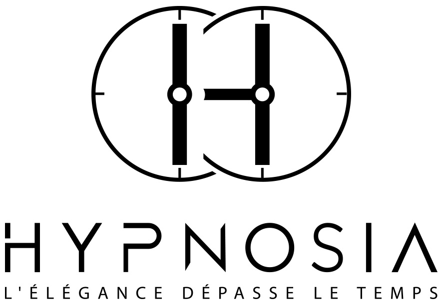
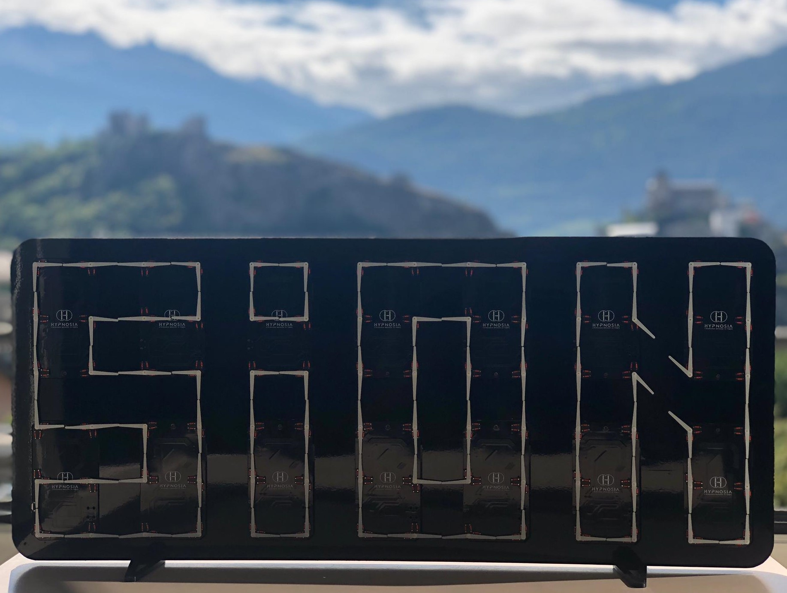

<h1 align="center">
   
  
   
</h1>

# Global Description

[Hypnosia](https://www.hypnosia.ch/) is a young startup from the Business eXperience (BeX) program, which was born from the union between
engineers and economists. 
 
Our start-up offers a brand new dynamic board that will take you to the rhythm of the watch pointers. Elegance, purity and simplicity best characterize our creation.
This “dancing display” is a matrix of clocks that reveals various hypnotising animations and guarantees a feeling of calm. See presentation video !
 
The realization of our product will be broken down into two diploma works.
 

# Breakdown of diploma work
Here is the breakdown:
 

 
1) "HYPNOSIA Calibration", carried out by De Campos Ruben, consists of the detection of the position of the watch pointers via image processing, an image taken by the user of the product. This information will then be sent via Bluetooth to the clock matrix to calibrate all the hands.
2) "HYPNOSIA Controller", carried out by Geraci Gregory, consists in the creation of the first prototype of the clock matrix. That is to say set up a system that can communicate via Bluetooth and control all the movements in order to create animations.
 

# HYPNOSIA Controller Description
Here is the "HYPNOSIA Controller" project:
 

 
Combining both the fields of mechatronics, electronics, computer science and mechanics, the project will consist in the development of a system to control and manage all of the movements. The system will also allow wireless remote control via a Bluetooth link.
 
 
The system is composed of a MASTER (Raspberry Pi), a GATEWAY (processor) and 13 SLAVES (processor). The system works as follows: the Raspberry Pi (MASTER) manages the Bluetooth connection and transmits the data required to control the motion matrix to the processor (GATEWAY) via SPI. This processor then processes the data received via SPI and transmits the data to all other processors (SLAVES) via a CAN bus. Each processor controls six bi-axis movements.
 
 
The diagram above shows the communications:
- Smartphone - MASTER via Bluetooth
- MASTER - GATEWAY via SPI
- GATEWAY - SLAVES via CAN
 
 

# Presentation video
Click on the logo !

# First prototype video
Click on the image below to see the video !
<h1 align="center">
   

   
</h1>

# Authors
**Geraci Gregory** - @[GeraciGregory](https://github.com/GeraciGregory)

